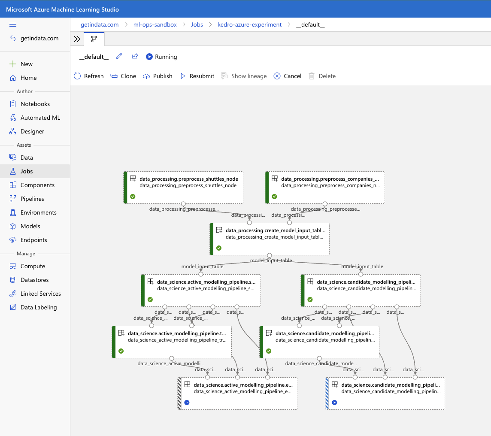
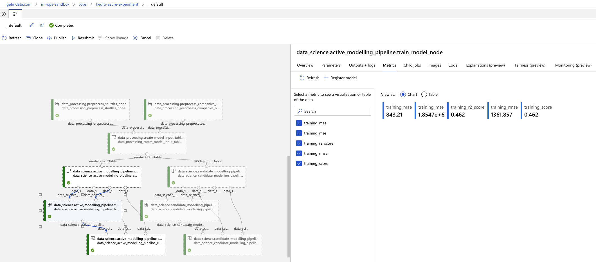

# kedro-azureml
Kedro plugin to support running workflows on Microsoft Azure ML Pipelines


# Getting started
## Prerequisites
* a tool to manage Python virtual environments (e.g. venv, conda, virtualenv).
* Docker
* Azure CLI

## Installation
```console
pip install kedro-azureml
```
or
```console
poetry add kedro-azureml
```

Optionally, extra can be specified: `kedro-azureml[mlflow]`.

## Quickstart
Before you start, make sure that you have the following resources created in Azure and have their **names** ready to input to the plugin:
* Azure Subscription ID
* Azure Resource Group
* Azure ML workspace
* Azure ML Compute Cluster
* Azure Storage Account and Storage Container
* Azure Storage Key (will be used to execute the pipeline)
* Azure Container Registry

1. Make sure that you're logged into Azure (`az login`). 
2. Prepare new virtual environment with Python >=3.9. Install the packages
```console
pip install "kedro>=0.18.2,<0.19" "kedro-docker" "kedro-azureml"
```

2. Create new project (e.g. from starter)
```console
kedro new --starter=spaceflights 

Project Name
============
Please enter a human readable name for your new project.
Spaces, hyphens, and underscores are allowed.
 [Spaceflights]: kedro_azureml_demo

The project name 'kedro_azureml_demo' has been applied to:
- The project title in /Users/marcin/Dev/tmp/kedro-azureml-demo/README.md
- The folder created for your project in /Users/marcin/Dev/tmp/kedro-azureml-demo
- The project's python package in /Users/marcin/Dev/tmp/kedro-azureml-demo/src/kedro_azureml_demo
```

3. Go to the project's directory: `cd kedro-azureml-demo`
4. Add `kedro-azureml` to `src/requriements.txt`
5. (optional) Remove `kedro-telemetry` from `src/requirements.txt` or set appopriate settings (https://github.com/kedro-org/kedro-plugins/tree/main/kedro-telemetry).
6. Install the requirements `pip install -r src/requirements.txt`
7. Initialize Kedro Azure ML plugin, it requires the Azure resource names as stated above. Experiment name can be anything you like (as long as it's allowed by Azure ML).
```console
#Usage: kedro azureml init [OPTIONS] RESOURCE_GROUP WORKSPACE_NAME
#                          EXPERIMENT_NAME CLUSTER_NAME STORAGE_ACCOUNT_NAME
#                          STORAGE_CONTAINER
kedro azureml init <resource-group-name> <workspace-name> <experiment-name> <compute-cluster-name> <storage-account-name> <storage-container-name> --acr <azure-container-registry-name>
```
```console
Configuration generated in /Users/marcin/Dev/tmp/kedro-azureml-demo/conf/base/azureml.yml
It's recommended to set Lifecycle management rule for storage container kedro-azure-storage to avoid costs of long-term storage of the temporary data.
Temporary data will be stored under abfs://kedro-azure-storage/kedro-azureml-temp path
See https://docs.microsoft.com/en-us/azure/storage/blobs/lifecycle-management-policy-configure?tabs=azure-portal
```

8. Adjust the Data Catalog - the default one stores all data locally, whereas the plugin will automatically use Azure Blob Storage. Only input data is required to be read locally. Final `conf/base/catalog.yml` should look like this:
```yaml
companies:
  type: pandas.CSVDataSet
  filepath: data/01_raw/companies.csv
  layer: raw

reviews:
  type: pandas.CSVDataSet
  filepath: data/01_raw/reviews.csv
  layer: raw

shuttles:
  type: pandas.ExcelDataSet
  filepath: data/01_raw/shuttles.xlsx
  layer: raw
```

8. Build docker image for the project:
```console
kedro docker init 
```

This command creates a several files, including `.dockerignore`. This file ensures that transient files are not included in the docker image and it requires small adjustment. Open it in your favourite text editor and extend the section `# except the following` by adding there:

```console
!data/01_raw
```

Invoke docker build
```console
kedro docker build --docker-args "--build-arg=BASE_IMAGE=python:3.9" --image=<image tag from conf/base/azureml.yml>
```
Once finished, push the image:
```console
docker push <image tag from conf/base/azureml.yml>
```

(you will need to authorize to the ACR first, e.g. by `az acr login --name <acr repo name>` )

9. Run the pipeline on Azure ML Pipelines. Here, the _Azure Subscription ID_ and _Storage Account Key_ will be used:
```console
kedro azureml run -s <azure-subscription-id> 
```

You will most likely see the following prompt:
```console
Environment variable AZURE_STORAGE_ACCOUNT_KEY not set, falling back to CLI prompt
Please provide Azure Storage Account Key for storage account <azure-storage-account>:
```
Input the storage account key and press [ENTER] (input will be hidden).

10. Plugin will verify the configuration (e.g. the existence of the compute cluster) and then it will create a _Job_ in the Azure ML. The URL to view the job will be displayed in the console output.
11. (optional) You can also use `kedro azureml run -s <azure-subscription-id> --wait-for-completion` to actively wait for the job to finish. Execution logs will be streamed to the console.
```console
RunId: placid_pot_bdcyntnkvn
Web View: https://ml.azure.com/runs/placid_pot_bdcyntnkvn?wsid=/subscriptions/<redacted>/resourcegroups/<redacted>/workspaces/ml-ops-sandbox

Streaming logs/azureml/executionlogs.txt
========================================

[2022-07-22 11:45:38Z] Submitting 2 runs, first five are: 1ee5f43f:8cf2e387-e7ec-44cc-9615-2108891153f7,7d81aeeb:c8b837a9-1f79-4971-aae3-3191b29b42e8
[2022-07-22 11:47:02Z] Completing processing run id c8b837a9-1f79-4971-aae3-3191b29b42e8.
[2022-07-22 11:47:25Z] Completing processing run id 8cf2e387-e7ec-44cc-9615-2108891153f7.
[2022-07-22 11:47:26Z] Submitting 1 runs, first five are: 362b9632:7867ead0-b308-49df-95ca-efa26f8583cb
[2022-07-22 11:49:27Z] Completing processing run id 7867ead0-b308-49df-95ca-efa26f8583cb.
[2022-07-22 11:49:28Z] Submitting 2 runs, first five are: 03b2293e:e9e210e7-10ab-4010-91f6-4a40aabf3a30,4f9ccafb:3c00e735-cd3f-40c7-9c1d-fe53349ca8bc
[2022-07-22 11:50:50Z] Completing processing run id e9e210e7-10ab-4010-91f6-4a40aabf3a30.
[2022-07-22 11:50:51Z] Submitting 1 runs, first five are: 7a88df7a:c95c1488-5f55-48fa-80ce-971d5412f0fb
[2022-07-22 11:51:26Z] Completing processing run id 3c00e735-cd3f-40c7-9c1d-fe53349ca8bc.
[2022-07-22 11:51:26Z] Submitting 1 runs, first five are: a79effc8:0828c39a-6f02-43f5-acfd-33543f0d6c74
[2022-07-22 11:52:38Z] Completing processing run id c95c1488-5f55-48fa-80ce-971d5412f0fb.
[2022-07-22 11:52:39Z] Submitting 1 runs, first five are: 0a18d6d6:cb9c8f61-e129-4394-a795-ab70be74eb0f
[2022-07-22 11:53:03Z] Completing processing run id 0828c39a-6f02-43f5-acfd-33543f0d6c74.
[2022-07-22 11:53:04Z] Submitting 1 runs, first five are: 1af5c8de:2821dc44-3399-4a26-9cdf-1e8f5b7d6b62
[2022-07-22 11:53:28Z] Completing processing run id cb9c8f61-e129-4394-a795-ab70be74eb0f.
[2022-07-22 11:53:51Z] Completing processing run id 2821dc44-3399-4a26-9cdf-1e8f5b7d6b62.

Execution Summary
=================
RunId: placid_pot_bdcyntnkvn 
```




## MLflow integration
The plugin is compatible with `mlflow` (but not yet with `kedro-mlflow`). You can use native mlflow logging capabilities provided by Azure ML. See the guide here: [https://docs.microsoft.com/en-us/azure/machine-learning/how-to-use-mlflow-cli-runs?tabs=azuremlsdk](https://docs.microsoft.com/en-us/azure/machine-learning/how-to-use-mlflow-cli-runs?tabs=azuremlsdk).

There is no additional configuration for MLflow required in order to use it with Azure ML pipelines. All the settings are provided automatically by the Azure ML service.




# Development
## Prerequisites
* poetry `1.1.14` (as of 2022-07-22)
* Python >= 3.9
* Azure CLI (https://docs.microsoft.com/en-us/cli/azure/install-azure-cli)

## Local development
It's easiest to develop the plugin by having a side project created with Kedro (e.g. spaceflights starter), managed by Poetry (since there is no `pip install -e` support in Poetry).
In the side project, just add the following entry in `pyproject.toml`:
```toml
[tool.poetry.dependencies]
kedro-azureml = { path = "<full path to the plugin on local machine>", develop = true, extras = ["mlflow"]}
```
and invoke
```console
poetry update
poetry install
```
and all of the changes made in the plugin will be immediately visible in the side project (just as with `pip install -e` option).

## Starting the job from local machine
Since you need a docker container to run the job in Azure ML Pipelines, it needs to be build first. For fast local development I suggest the following:
1. Once you decide to test the plugin, run `poetry build`. It will create `dist` folder with `.tar.gz` file in it.
2. Go to the side project folder, create a hard-link to the `.tar.gz`: `ln <full path to the plugin on local machine>/dist/kedro-azureml-0.1.0.tar.gz kedro-azureml-0.1.0.tar.gz`
3. In the `Dockerfile` of the side project add
```Dockerfile
COPY kedro-azureml-0.1.0.tar.gz .
RUN pip install ./kedro-azureml-0.1.0.tar.gz
```
4. Build the docker with `:latest` tag (make sure that `:latest` is specified in the plugin's config `azureml.yml` in `conf`), push the image and run the plugin.
5. Done!