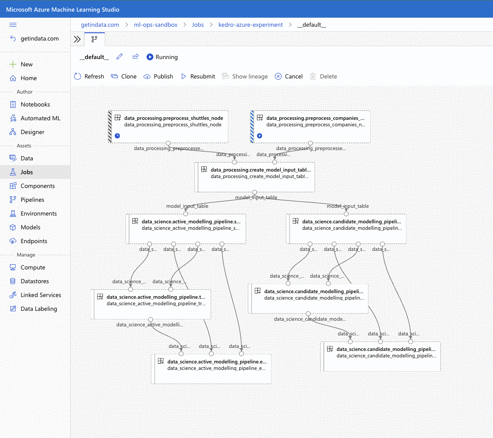

# Introduction

## What Azure ML Pipelines?

An [Azure Machine Learning pipeline](https://docs.microsoft.com/en-us/azure/machine-learning/concept-ml-pipelines)
is an independently executable workflow of a complete machine learning task. An Azure Machine Learning pipeline helps
to standardize the best practices of producing a machine learning model, enables the team to execute at scale,
and improves the model building efficiency.

## Why to integrate Kedro project with Azure ML Pipelines?

Throughout couple years of exploring ML Ops ecosystem as software developers we've been looking for
a framework that enforces the best standards and practices regarding ML model development and Kedro 
Framework seems like a good fit for this position, but what happens next, once you've got the code ready? 

It seems like the ecosystem grown up enough so you no longer need to release models you've trained with 
Jupyter notebook on your local machine on Sunday evening. In fact there are many tools now you can use 
to have an elegant model delivery pipeline that is automated, reliable and in some cases can give you 
a resource boost that's often crucial when handling complex models or a load of training data. With the 
help of some plugins **You can develop your ML training code with Kedro and execute it using multiple 
robust services** without changing the business logic. 

We currently support:
* Kubeflow Pipelines [kedro-kubeflow](https://github.com/getindata/kedro-kubeflow)
* Airflow on Kubernetes [kedro-airflow-k8s](https://github.com/getindata/kedro-airflow-k8s)
* GCP Vertex AI Pipelines [kedro-vertexai](https://github.com/getindata/kedro-vertexai)

And with this **kedro-azureml** plugin, you can run your code on Azure ML Pipelines in a fully managed fashion 

